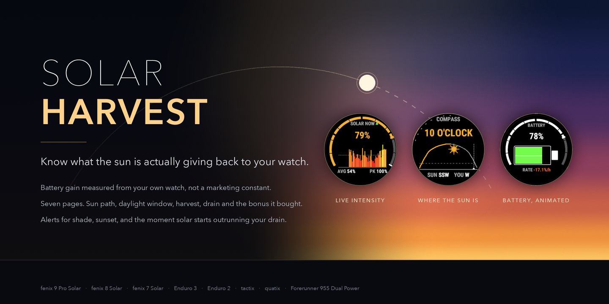
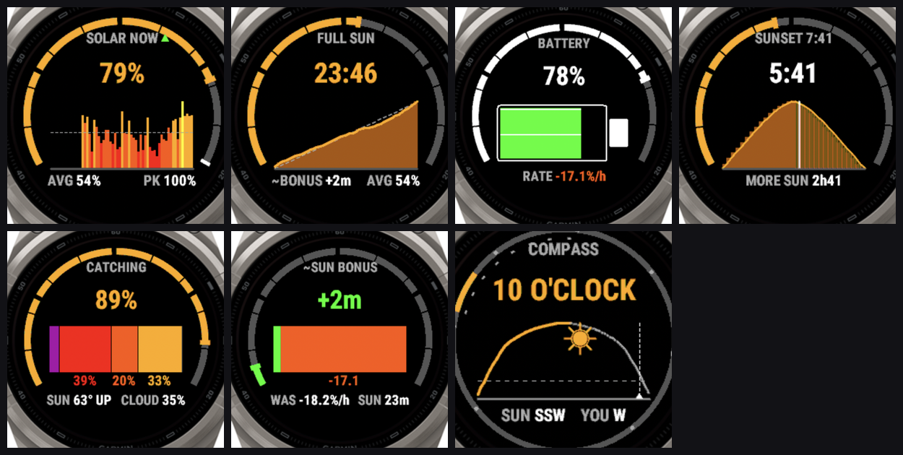
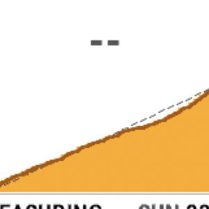

# ☀️ Solar Harvest

**A Connect IQ data field that finally tells you what your solar watch is actually doing with all that sunlight.**



Garmin put a solar panel on your watch. It shows you a tiny sun icon and calls it a day. Solar Harvest rips that icon off and replaces it with an entire measurement instrument: real drain and gain rates measured from your own battery (not a marketing constant), a live sun compass that tracks the sky, a battery icon that actually animates, and enough honest, well tested data science to make you feel like your watch has a PhD in astrophysics.

It is free. It always will be. See [Supporting this project](#supporting-this-project) if you want to say thanks anyway.

## Table of contents

- [Why this exists](#why-this-exists)
- [The seven pages](#the-seven-pages)
- [When each number appears](#when-each-number-appears)
- [What makes it actually good](#what-makes-it-actually-good)
- [Alerts](#alerts)
- [Supported devices](#supported-devices)
- [Getting it on your watch](#getting-it-on-your-watch)
- [Building it yourself](#building-it-yourself)
- [How it is put together](#how-it-is-put-together)
- [Testing, and why there is so much of it](#testing-and-why-there-is-so-much-of-it)
- [Known limits](#known-limits)
- [Contributing](#contributing)
- [License](#license)
- [Supporting this project](#supporting-this-project)

## Why this exists

Every solar Garmin ships with the same quiet lie baked into its default watch face: a little sun glyph that is either lit or it is not. It never tells you how much sun, whether the canopy overhead is actually blocking it, or whether the last hour genuinely bought you extra battery or you just got lucky with the weather.

Solar Harvest was built to answer the question a solar watch should have been answering the whole time: **is the sun actually helping right now, and by how much?**

Every number this field shows is either raw physics (the sun's real position, computed from the NOAA solar equations, not a weather API that goes stale the moment your phone stops syncing) or something measured off your own watch's own battery, on this device: from this activity, or, marked with a `~`, from earlier ones. Nothing is a guessed constant dressed up as a fact.

## The seven pages

Cycle through them automatically, pin your favorite, or map the lap button to flip pages on demand (see [Lap button behavior](#lap-button-behavior)).



| Page | What it tells you |
| --- | --- |
| **Solar Now** | Live intensity, a scrolling bar chart of the last several minutes, and this activity's average and peak |
| **Full Sun Time** | Your sunlight added up as time at full intensity (an hour at 50% counts as 30 minutes), the share of the activity spent in sun, and the runtime that sun bought once there is enough evidence to measure it |
| **Battery** | An animated battery icon (not a chart) that fills and flows in the direction your level is actually moving, beside the drain or gain rate as soon as there is evidence for one |
| **Sun Window** | TO SUNSET: the daylight left, over a live daylight arc showing where you are in the day with the sunset's clock time at its foot, and SUN LEFT: the full sun still to come before sunset if the panel keeps catching it at today's rate |
| **Catching** | The signature metric: what share of the sunlight your position and the sun's height *should* be delivering are you actually catching. Low despite a high sun means shade, canopy, or a sleeve, not a broken sensor |
| **Sun Bonus** | The hour's drain, split into what the sun paid for and what your battery paid for, fitted by regression against your own measured data, beside UNLIT, what the hour would have cost with no light on the panel. It is the slowest number to earn (see below) and is marked with a `~` whenever it relies on earlier activities. While it measures, the page says how far along the evidence is, in percent |
| **Compass** | Where the sun actually is right now, plus its whole path across today's sky, dotted ahead of your current position like a weather radar loop |

One rule for every time on the field: a colon is a clock time (the 7:41 at the foot of the daylight arc), and h and m are a duration (TO SUNSET 5h41, FULL SUN 23m).

An animated preview, captured straight from the simulator:



## When each number appears

Your watch reports its battery in steps, whole percent on the watches this has been tested on, and every battery number here is measured from those steps rather than estimated, so some numbers take much longer than others. The times below assume whole percent steps and a typical drain of about 2% an hour during a GPS activity. A watch that drains faster, or reports finer steps, gets there sooner.

| Number | What it needs | Typically |
| --- | --- | --- |
| Solar intensity and full sun time | Nothing but the solar sensor | Right away |
| Catching, Sun Window, Compass | Your location from the activity's GPS. Catching also needs the sun at least 15° up, and the compass only appears while the sun is above the horizon | As soon as GPS locks |
| Early drain figure on the Battery page | 5 minutes at one level for an upper bound (`<`), then an early read (`~`) once the level first changes | Upper bound at 5 minutes, early read within about 30 minutes |
| Battery rate and runtime left, on the watch and in Garmin Connect | Two 1% steps at least 5 minutes apart, and 10 minutes of timer | Within about an hour |
| Battery gain alert | A confirmed rate showing gain, meaning your latest 1% step sits above your first one, held for 2 minutes | Rare during a GPS activity: the sun has to repay everything used since that first step |
| Sun Bonus from one activity, and the Solar Saving stat in Garmin Connect | 13 battery steps (12 gaps between them), with average light differing by at least 25 points between the sunniest and shadiest gap | About 6 to 6.5 hours in that activity |
| Sun Bonus from one activity, the early rule | 6 battery steps (5 gaps) with light differing by at least 20 points, when the drain followed the light so plainly that the fitted slope stands three standard errors clear of zero against the gaps' own scatter | About 2.5 to 3 hours of mixed sun and shade. A day of even light, or a drain that wandered on its own, never passes this rule, however long |
| Sun Bonus pooled across activities | The same amount of evidence spread over several activities (below) | About six 2-hour activities, or three 3-hour ones |

Pooling has one rule that makes it slower than simply adding hours together. Only light that changed during an activity can show what light is worth, because every activity also has its own baseline drain from GPS mode, backlight, and heat. So each activity counts its battery steps minus 2 toward a total of 11, which is exactly what a single 13 step activity holds, and the light has to have varied within those activities at least as much as that single activity would need. An activity that ends before its third step (60 to 90 minutes at 2% an hour, depending on where the level sat when it started) adds nothing to Sun Bonus. One spent in unchanging light adds to the count but teaches it nothing about light, which is why the typical figures above assume every activity mixes sun and shade. The early rule pools the same way: five gaps' worth of evidence across activities can quote a bonus once the pooled slope is that sure of itself.

Once there is enough, later activities no longer wait: Sun Bonus appears, marked `~`, as soon as the sun has bought that activity a whole minute of runtime. An activity that gathers enough evidence on its own switches to its own measurement and drops the `~`. Once about 120 gaps' worth of evidence has built up, older activities are scaled back as new ones arrive, so the estimate follows your watch as its battery ages. The Solar Saving stat in Garmin Connect is only ever written from the activity's own measurement, never from earlier ones.

## What makes it actually good

A few of the decisions under the hood, for anyone who likes reading source code as much as I do:

- **Real solar geometry, not a weather cache.** Sunrise, sunset, elevation, and azimuth all come from the NOAA solar position equations, computed on-device from your GPS fix and the date. `Weather.getSunset()` returns whatever your phone last synced, which on a watch that has not paired all day is simply `null`. Geometry does not have that problem.
- **Battery numbers are measured, never assumed.** The drain and gain rates you see are measured between transitions in your own battery's own reporting, debounced against the sensor's natural dither. Until a rate is confirmed it is shown as an upper bound (`<`) or an early read (`~`), or not at all, and a dash is a better answer than a lie.
- **The "sun bonus" is a real regression, not a fixed ratio, and it learns across activities without being fooled by them.** How much runtime the sun bought you is fitted from your own battery's measured drain against how much light you were actually getting. One activity rarely holds enough evidence, so it pools across activities as a fixed-effects fit: every activity is measured against its own average drain before anything is combined. A sunny day that happened to use a hungrier GPS mode can never be read as the sun costing you battery. Past about 120 gaps' worth of evidence, older activities are scaled back so the estimate follows your watch as its battery ages. The running totals are saved every 5 minutes, so an activity that crashes still counts, less at most its last 5 minutes, and no activity is ever counted twice. Anything resting on earlier activities is marked with a `~`.
- **Every developer field actually shows up on Garmin Connect.** Getting a `FitContributor` field into the raw `.FIT` file is the easy half. Connect's charts and activity summary need a second resource, `fitContributions.xml`, mapping each field to a chart title, a unit, and a color, keyed purely by numeric id. Skip it and your data records perfectly and Connect shows nothing at all. Fourteen fields make that trip correctly here.
- **Three device generations, one codebase.** The fēnix 7 line runs an older Connect IQ API than everything released after it, and the fēnix 6 Pro line an older one still. Both miss a callback (`onTimerLap2`) that everything newer gets, so the build compiles that one code path out for them and falls back to the older callback. The fēnix 6 Pro's API also refuses any method with more than nine parameters and counts the app's code against its memory limit, so the code stays inside both rules. The whole fēnix 6 Pro through fēnix 9 lineup ships from the same source.
- **The compass ring is a real animation of time, not a snapshot.** Half of it is solid (where the sun has already been), and a dotted arc sweeps ahead of it (where it is still going before sunset), the same visual language a weather radar loop uses for "already happened" versus "about to happen."

### Lap button behavior

Pressing the physical lap button always records a lap. A data field has no way to prevent that, whether or not Solar Harvest is even installed. The optional "Lap button also changes page" setting (off by default, with a note in the settings saying exactly this) rides along on that same unavoidable button press to flip pages too, but only for an actual manual press, never for an automatic lap the watch triggers itself by distance, time, or a workout step. Turn it on and pace intervals with auto-lap enabled without your data field silently flipping pages under you every mile.

## Alerts

Four `DataFieldAlert` cards, tuned to say something only when it is actually worth interrupting you for:

- **Battery gain**: your battery has measurably climbed, its latest 1% step now above the first one this activity (rare during GPS use; see [When each number appears](#when-each-number-appears))
- **In shade**: a sustained drop in light, not a passing cloud shadow
- **Back in sun**: recovery after a shade alert
- **Sunset warning**: full sun is about to run out for the day

Each one is built to refuse far more often than it fires: minutes-long holds before triggering, a dead band between thresholds so it cannot flap, and a refractory window so the same condition cannot re-alert every second it stays true.

## Supported devices

One `manifest.xml` entry is often several retail names sharing identical hardware underneath (a fēnix 7X is also sold as a tactix 7, a quatix 7X Solar, and an Enduro 2, for instance), so the real compatibility list runs longer than the 17 build targets suggest:

fēnix 6 Pro Solar · fēnix 6S Pro Solar · fēnix 6X Pro Solar · fēnix 7 · fēnix 7 Pro · fēnix 7 Pro Solar (No Wi-Fi) · fēnix 7S · fēnix 7S Pro · fēnix 7X · fēnix 7X Pro · fēnix 7X Pro (No Wi-Fi) · fēnix 8 Solar (47mm / 51mm) · fēnix 9 Pro Solar (47mm / 51mm) · Enduro 2 · Enduro 3 · tactix Delta Solar · tactix 7 · tactix 8 Solar (51mm) · quatix 6X Solar · quatix 7 · quatix 7X Solar · Forerunner 955 Dual Power

That spans three Connect IQ API generations and three physical screen sizes (240px, 260px, and 280px, all round), and the layout is verified against real simulator captures at every size, not just the one watch this was built on.

## Getting it on your watch

Install it from the Connect IQ Store on your phone or from [its store page](https://apps.garmin.com/en-US/apps/b0d0fd86-bc11-4d9a-9f78-40db5c7b7fa0). If you would rather build it from source, see below.

## Building it yourself

You will need:

- The [Connect IQ SDK](https://developer.garmin.com/connect-iq/sdk/) (built and tested against 9.2.0)
- A Connect IQ developer key (`monkeyc --help` under `-y`, or generate one with the SDK's key tool)
- Garmin's Connect IQ VS Code extension, or the SDK's command line tools directly

```bash
# Build for the simulator
monkeyc -d fenix9prosolar51mm -f monkey.jungle -o bin/SolarHarvest.prg -y developer_key

# Build a distributable package for every supported device at once
monkeyc -e -f monkey.jungle -o dist/SolarHarvest.iq -y developer_key -r

# Run the unit test suite
monkeyc -d fenix9prosolar51mm -f monkey.jungle -o bin/test.prg -y developer_key --unit-test
monkeydo bin/test.prg fenix9prosolar51mm -t
```

The `tools/` directory has the scripts used to generate every screenshot and the GIF in this README, straight from the simulator. They need `CIQ_SDK_BIN` pointed at your SDK's `bin/` directory and Python's `pyobjc-framework-Quartz` for window capture (macOS only). `tools/check_fit.py` is worth knowing about too: point it at a `.FIT` file pulled off your watch and it tells you exactly which developer fields made it in and whether Connect has any chance of rendering them, which will save you the multi-hour detour it took to learn this app needs `fitContributions.xml` at all.

## How it is put together

```
source/
  SolarPowerView.mc     the field itself: seven pages, rendering, settings, alerts wiring
  SolarModel.mc         solar intensity tracking, smoothing, trend, zones, calibration carried between activities
  BatteryModel.mc       edge-to-edge drain/gain measurement, per-activity and pooled regression, projections
  SolarGeometry.mc      NOAA solar position equations (elevation, azimuth, sunrise/sunset)
  SolarAlerts.mc        alert condition logic
  SolarAlertView.mc     the full-screen alert card
  FitRecorder.mc        the fourteen developer FIT fields
  LayoutPlanner.mc      vertical layout math shared by every page
  SafeArea.mc           keeps content clear of a round bezel and any obscuring UI
  Palette.mc            the color system, tuned for a reflective MIP display
  SunWindow.mc          shared daylight-window state
  SolarPowerApp.mc      the Connect IQ application entry point

resources/
  fitContributions/     tells Garmin Connect how to chart the FIT fields above
  settings/, strings/   user-facing settings and every string, ready for translation

tools/                  screenshot, GIF, and FIT-inspection tooling used to build docs/
docs/                   the images and GIF in this README
```

## Testing, and why there is so much of it

104 unit tests on the newest device tier, and 99 on each of the fēnix 7 and fēnix 6 Pro generations (five exercise a callback those watches do not have, and the fēnix 6 Pro swaps one memory check for its own). They run against every layout size the field ships to, not just one, and a stress section deliberately hammers the field with a dense sweep of times of day, extreme battery states, adversarial multi-day alert sequences, and a long-activity soak test checking for integer accumulators that would otherwise overflow on an ultra-length ride.

A few things worth knowing if you are reading the test file:

- `FitContributor.Field` cannot be constructed at all outside a live, watch-recorded activity. It throws a native error that bypasses Monkey C's own exception handling entirely, so `FitRecorder` itself is untestable by design, and every test that builds a view sets `gSkipFitRecording` first. What *is* tested is every piece of arithmetic that feeds it.
- The calibration carried between activities is tested through real storage, not a mock: an activity stopped and resumed is committed exactly once, an activity that crashed before it could finish is folded in by the next one, a field restarted mid-activity never counts its own activity twice, and a Sun Bonus saved by the first release is carried forward exactly once.
- The Connect IQ simulator has its own sharp edges: a crashed run leaves it pinned on a crash screen that then poisons every later screenshot, and a simulator that has been running a while can report frame costs several times higher than a fresh one. `tools/preview.sh` restarts the simulator before every single capture because of the first one.

## Known limits

Being upfront about what this project cannot do, because a features list with no edges is not a features list you should trust:

- **No real device battery-life (mAh) measurement.** Everything here is measured in percentage points per hour off the OS's own reporting, which is the only battery signal a Connect IQ data field is given. It cannot see the actual chemistry.
- **Sun Bonus takes real time to earn.** A battery reported in whole percent only holds so much evidence per hour. With plainly changing light, Sun Bonus can appear after about 2.5 to 3 hours in one activity (the early rule); with subtler contrast it needs about 6 to 6.5 hours, or roughly six 2-hour activities with changing light pooled together, and an activity too short to see three battery steps adds nothing to it. Until then it reads MEASURING with a percentage: how far the evidence is toward the first figure, counting both the battery steps pooled so far and how much the light has varied within them, whichever is further behind. Even light through many steps stays at zero, because it teaches nothing about the sun. That is the honest answer rather than a bug. See [When each number appears](#when-each-number-appears).
- **The fēnix 6 Pro builds have only run in the Connect IQ simulator so far.** There they pass every test on all three screen sizes, render every page, hold steady memory with over 40% to spare, and stay well inside the watchdog limit that stops code running too long, but nobody has worn one with this field yet. The fēnix 6 also has a slower processor than the watches this was built on. If you run it on one, an issue saying how it went is very welcome.
- **Instinct, the non-Pro fēnix 6 Solar and 6S Solar, and rectangular color devices (like the solar Edge bike computers) are not supported.** The solar Instinct models and the non-Pro fēnix 6 Solar and 6S Solar give a data field 32 KB of memory, while this one uses about 49 KB running on a fēnix 9 and about 60 KB on a fēnix 6 Pro, where the code counts against the same limit. The Instinct line also has a 1-bit display and a non-round screen this project's rendering was never built for. It is a real redesign, not a checkbox.

## Contributing

Issues and pull requests are welcome. If you are proposing a design change, a screenshot or two goes a long way, this app lives and dies by how it actually looks on a real screen.

## License

[PolyForm Noncommercial License 1.0.0](LICENSE.md). Use it, learn from it, fork it, adapt it for your own watch face or data field. Just do not sell it, or a product built on it, or a service built around it. If you are a business and want to do something this license does not allow, open an issue and let's talk.

## Supporting this project

Solar Harvest is free on the Connect IQ Store and always will be. If it made your watch a little more interesting and you would like to say thanks, you can do that here:

> ☕ [Ko-fi/texasbe2trill](https://www.ko-fi.com/texasbe2trill)
